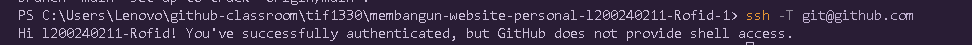
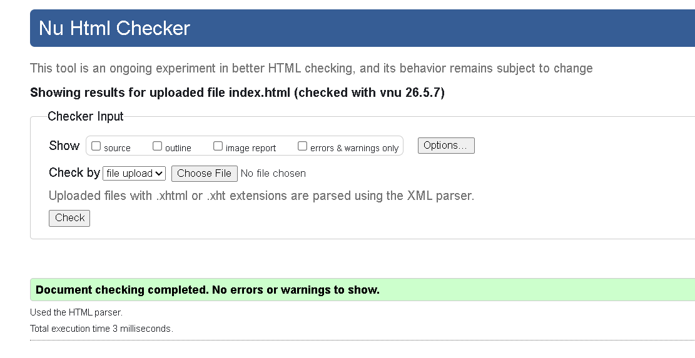
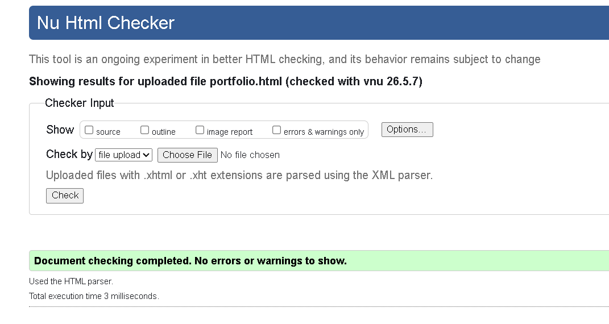
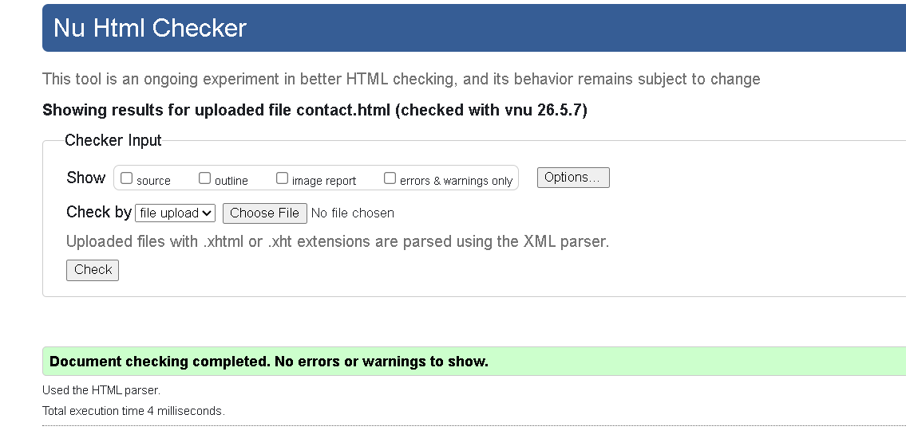
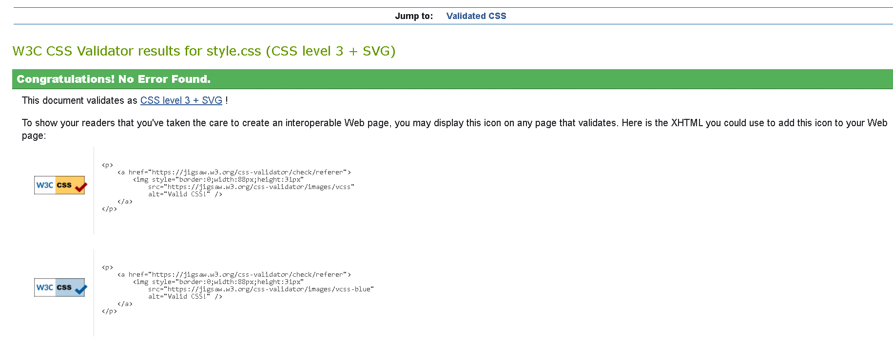
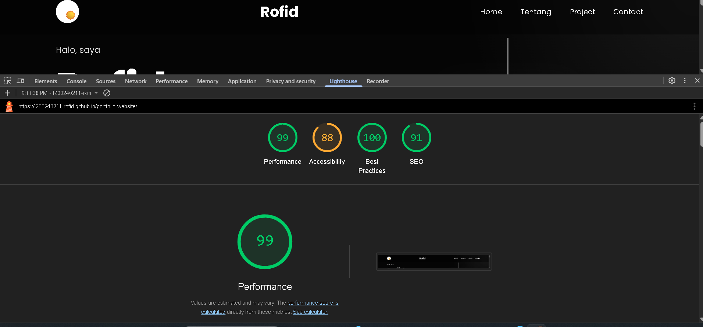

# LAPORAN PROJECT WEBSITE PERSONAL

## Identitas Mahasiswa

- Nama : Rofid
- NIM : I200240211
- Mata Kuliah : Pemrograman Web

---

# Deskripsi Proyek

Project ini merupakan website portfolio personal yang dibuat menggunakan HTML, CSS, dan JavaScript. Website digunakan untuk menampilkan informasi pribadi, skill, project, serta halaman contact.

Website memiliki desain modern dengan kombinasi warna hitam dan putih, responsive untuk berbagai ukuran layar, serta mendukung fitur dark mode dan light mode.

---

# Tujuan Project

Tujuan dari project ini adalah:

- Membuat website portfolio personal modern
- Melatih kemampuan HTML dan CSS
- Memahami struktur website responsive
- Menerapkan accessibility dasar (a11y)
- Menghubungkan website dengan GitHub Pages

---

# Fitur Utama

- Halaman Home
- Halaman Portfolio / Tentang
- Halaman Contact
- Responsive Design
- Dark Mode & Light Mode
- Navigasi Antar Halaman
- Social Media Link
- Accessibility Support
- Icon SVG Sosial Media

---

# Teknologi yang Digunakan

- HTML5
- CSS3
- JavaScript
- Google Fonts
- SVG Icons
- Git & GitHub

---

# Link Website
https://l200240211-rofid.github.io/portfolio-website/


---

# Konfigurasi GitHub


---

# Validasi Index


---

# Validasi Portfolio


---

# Validasi Contact


---

# Validasi CSS


---

# Hasil Lighthouse


---


# Struktur Folder Project

```text
portfolio-website/
│
├── css/
│   └── style.css
│
├── images/
│   ├── profile.jpeg
│   └── icons/
│       ├── instagram.svg
│       ├── whatsapp.svg
│       ├── github.svg
│       └── linkedin.svg
│
├── index.html
├── portfolio.html
├── contact.html
├── favicon.ico
└── LAPORAN.md

